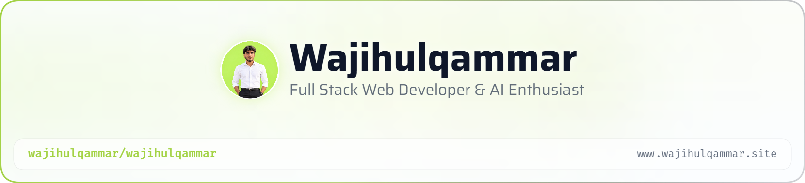

<picture>
   <source media="(prefers-color-scheme: dark)" srcset="art/header-dark.png">
   
</picture>

 

# Hey there, I'm Wajih Ul Qammar 👋

 

 

## 🧑‍💻 About Me

I'm a **Full Stack Web Developer** specializing in the **MERN stack**, focused on building scalable, **AI-integrated web applications**. Alongside this, I have strong hands-on experience with **WordPress** and **Shopify**, building custom themes, plugins, and e-commerce solutions for businesses looking to grow online.

- 🎓 BS Computer Software Engineering student at **Capital University of Science & Technology (CUST)**, Islamabad
- 💼 Currently working as a **Shopify Developer** at IR Solutions, and as a **Software Engineer** at Auremix (remote)
- 🧠 Actively exploring **AI integration** in modern web development
- 🌍 Open to remote opportunities worldwide in web development & full-stack roles
- ⚡ Fun fact: I turn ideas into fully functional web apps and online stores, end to end

I work with modern technologies including:

- MERN Stack (MongoDB, Express.js, React, Node.js)
- Next.js
- WordPress Development
- Shopify Development
- Django & Python
- MySQL & PostgreSQL
- Artificial Intelligence (AI) concepts & integration
- Git & GitHub

 

## 🛠️ Tech Stack

  

 

## 📊 GitHub Stats

 

<!--
NOTE: If the GitHub Stats card or Activity Graph shows a broken/alt-text image,
it's a temporary rate-limit on the free Vercel-hosted service (not your code).
Hard refresh (Ctrl+Shift+R) or wait a few minutes and it usually resolves.
If it keeps breaking, deploy your own copy of github-readme-stats to Vercel
(https://github.com/anuraghazra/github-readme-stats) and swap the URL above
for your own deployed domain.
-->

 

<!-- 🐍 Contribution Snake -->

## 🐍 Contribution Snake

<!--
IMPORTANT: This snake image stays broken until you add the workflow below.
Create a file at: .github/workflows/snake.yml in your wajihulqammar/wajihulqammar repo,
then go to the Actions tab and manually run it once ("Run workflow").
After it runs successfully, the image above will start working.

name: Generate Snake
on:
  schedule:
    - cron: "0 0 * * *"
  workflow_dispatch:
jobs:
  build:
    runs-on: ubuntu-latest
    steps:
      - uses: Platane/snk@v3
        with:
          github_user_name: wajihulqammar
          outputs: |
            dist/github-contribution-grid-snake.svg
            dist/github-contribution-grid-snake-dark.svg?palette=github-dark
      - uses: crazy-max/ghaction-github-pages@v3
        with:
          target_branch: output
          build_dir: dist
        env:
          GITHUB_TOKEN: ${{ secrets.GITHUB_TOKEN }}
-->

 

## 🤝 Connect With Me

 

<picture>
  <source media="(prefers-color-scheme: light)" srcset="https://capsule-render.vercel.app/api?type=waving&color=0:1B5E20,100:2EA043&height=150&section=footer"/>
  <source media="(prefers-color-scheme: light)" srcset="https://capsule-render.vercel.app/api?type=waving&color=0:A8E6A1,100:2EA043&height=150&section=footer"/>
  
</picture>
